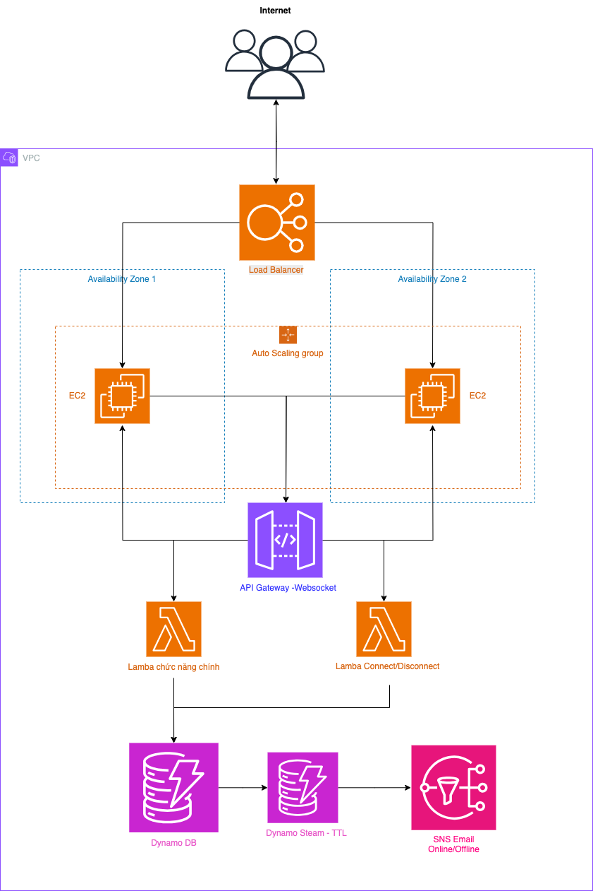

# 🕹️ BUILD TICTACTOE HIGH AVAILABLE  WEBSITE ONLINE WITH SERVERLESS ARCHITECTURE IN AWS 

## 🌐 Project Overview

This project demonstrates how to build a **highly available online TicTacToe game** using **Serverless Architecture** on **AWS**. It combines **WebSocket communication**, a **serverless backend**, and a **high availability frontend** infrastructure to provide a seamless, real-time gaming experience.

The system leverages a mix of **serverless services** (Lambda, DynamoDB, API Gateway) for backend logic and **compute infrastructure** (EC2, ALB, ASG, VPC) to ensure availability and scalability.

### 🖼️ Architecture Diagram

---

## 🛠️ Technologies Used

### ✅ Backend (Serverless Architecture)

- **AWS Lambda**  
  Handles backend logic for WebSocket API routes such as:
  - `connect`, `disconnect`
  - `sendMessage`, `joinRoom`, `getRoom`  
  Executes business logic upon invocation by API Gateway.

- **AWS API Gateway (WebSocket API)**  
  - Manages WebSocket connections with custom routes.
  - Triggers Lambda functions based on messages from clients.
  - Enables real-time bidirectional communication.

- **AWS DynamoDB**  
  - NoSQL database for storing game rooms, player info, and game state.
  - Implements **Time to Live (TTL)** for auto-expiry of stale data.
  - Uses **Streams** for tracking player online/offline status.

- **Amazon CloudWatch**  
  - Collects logs and metrics from **Lambda**, **API Gateway**, and **DynamoDB**.
  - Provides real-time monitoring for function invocation counts, durations, errors, throttles, and custom metrics.
  - Dashboards visualize game traffic, active players, and system health.

- **AWS SNS (Simple Notification Service)**  
  - Sends email alerts (e.g. player disconnected) based on DynamoDB stream events handled by Lambda.

---

### 🖥️ Frontend (Web Hosting + High Availability)

- **Amazon EC2 (Amazon Linux)**  
  - Hosts the online website on a public IPv4 address.
  - Runs application code and serves static content.

- **NGINX**  
  - Acts as a reverse proxy and web server.
  - Maps local IP to public IP, enabling access via HTTP/HTTPS.

- **Auto Scaling Group (ASG)**  
  - Automatically scales EC2 instances based on demand.
  - Ensures consistent performance during traffic spikes.

- **Application Load Balancer (ALB)**  
  - Distributes incoming traffic across EC2 instances.
  - Enhances fault tolerance and performance.

- **AWS VPC (Virtual Private Cloud)**  
  - Provides isolated network infrastructure.
  - Includes subnets, security groups, and routing for resource control.

---

### 🔧 EC2 Bootstrapping

- **Bash Scripts**  
  - Automatically install NGINX.
  - Generate a simple HTML page displaying EC2 instance metadata (e.g., public IP).

---

## 📈 Key Features

- Real-time gameplay using WebSocket communication.
- Automatically detects and notifies about player presence changes.
- Scalable and highly available architecture with EC2 + ALB + ASG.
- Secure and structured AWS environment using VPC.
- Modular and maintainable infrastructure using serverless components.

---

## 📬 Contact

For questions, feel free to reach out or open an issue.  
Happy coding and gaming! 🎮

**Le Nguyen Phuc Loc**  
*DevOps Engineer*  
📧 phuclocdh2017@gmail.com